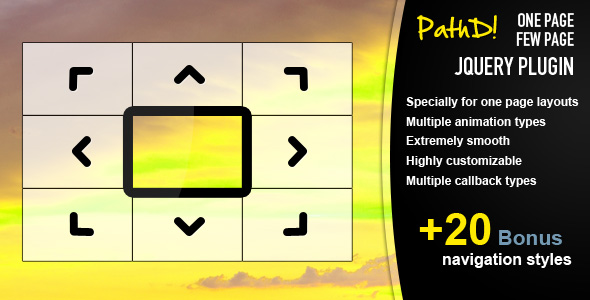

# Warning

This repository is not maintained, it is only here for historical reasons.

# pathd - jQuery Plugin - 2012

Demo: [https://wintercounter.github.io/pathd](https://wintercounter.github.io/pathd)

<h3>Description</h3>
The <strong>One Page Few Page</strong> plugin allows you to create grid based one-page layouts or you can use for other things if you need a unique style display. Animations are really <strong>smooth</strong> even with lot&#8217;s of contents (not necessarily on mobile). Using this plugin is simple but may be a bit complicated for absolute beginners as it requires to rewrite some HTML elements. You can adjust the plugin with parameters and it has custom methods and callbacks too. The plugin is fully documented.

<h3>Help with setup</h3>
The price includes <strong>free</strong> help with the basic setup of the plugin over TeamViewer. (Doesn&#8217;t contain this for already created sites as it may require many adjustments if site is not created from scratch.)

<h3 id="item-description__features">Features</h3>
<ul>
<li>Suitable for responsive designs</li>
<li>One Page Layouts</li>
<li>Multiple Animation Types</li>
<li>Extremely Smooth</li>
<li>Highly Customizable</li>
<li>Multiple Callbacks</li>
<li>Multiple Built-in Methods</li>
<li>Mobile Swipe Support</li>
<li>+20 Bonus Navigation Styles</li>
</ul>

